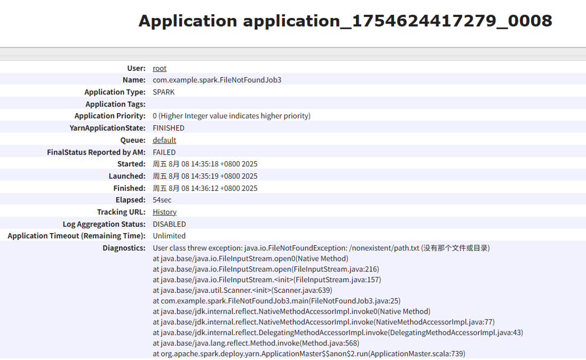

# Spark Error Task Test
This project demonstrates **common issues that Spark jobs may encounter** along with their log outputs, for assisting in Sonic information analysis.  
It includes:  
✅ Original `reduceByKey` job (causing data skew)  
✅ Optimized version (random prefix + two-stage aggregation)  
✅ Spark SQL version (DataFrame implementation)  
✅ Various Java exceptions combined with Spark job failures

  1. [DivideByZeroJob.java](#dividebyzerobjobjava)
  2. [DivideByZeroJob2.java](#dividebyzerobjob2java)
  3. [DivideByZeroJob3.java](#dividebyzerobjob3java)
  4. [FileNotFoundJob.java](#filenotfoundjobjava)
  5. [FileNotFoundJob2.java](#filenotfoundjob2java)
  6. [FileNotFoundJob3.java](#filenotfoundjob3java)
  7. [NullPointerJob.java](#nullpointerjobjava)
  8. [MemoryExplodeExample.java](#memoryexplodeexamplejava)
  9. [DynamicExecutorExample.java](#dynamicexecutorexamplejava)  
  
  | java.class                  | java wrong | spark wrong | target                                                                 | result                                             | reason                              |
  |-----------------------------|------------|-------------|------------------------------------------------------------------------|----------------------------------------------------|-------------------------------------|
  | DivideByZeroJob.java        |            | ✅           | test one job failed in the middle whether subsequent job work          | job failed, subsequent job don't work              | stop in middle job                  |
  | DivideByZeroJob2.java       |            | ✅           | test one job failed in the last                                        | application failed                                 | job failed                          |
  | DivideByZeroJob3.java       | ✅          | ✅           | test one java exception in the middle whether subsequent job work      | subsequent job don't work                          | stop in middle job                  |
  | FileNotFoundJob.java        | ✅          |             | test one java exception after job succeed and judge application status | application failed                                 | java exception                      |
  | FileNotFoundJob2.java       |            | ✅           | test one job failed after a job succeed                                | only one jobEnd log                                | Hadoop.mapred.InvalidInputException |
  | FileNotFoundJob3.java       | ✅          | ✅           | test one java exception in the middle                                  | only one jobEnd log and subsequent job don't work  | stop in the middle                  |
  | NullPointerJob.java         | ✅          |             | test one job failed in the last                                        | application failed                                 | job failed                          |
  | MemoryExplodeExample.java   |            | ✅           | test memory allocation over than config to judge executor remove       | executor terminated by yarn and warn exit code 143 | outOfMemory                         |
  | DynamicExecutorExample.java |            |             | test executor dynamic allocation to judge executor remove              | succeed                                            |                                     |


## 🚀 How to Run
The project is deployed on VMware with three virtual machines, where Hadoop and Spark are installed. Jobs are scheduled by YARN and run in **cluster mode**.

### 1️⃣ Build the Project
```bash
mvn clean package
```


### 2️⃣ Submit to Spark
```bash
spark-submit   --class com.example.spark.*   target/spark-data-skew-demo-1.0-SNAPSHOT.jar
```

### 3️⃣ View Spark UI
- While running: [http://localhost:8088](http://localhost:8088)
- After completion: [http://localhost:18080](http://localhost:18080)  
  Here you can see **detailed information for each application** and **event logs for each application**.

---

## 🔥 Detailed Cases
<a id="dividebyzerobjobjava"></a>
[DivideByZeroJob.java](src\main\java\com\example\spark\DivideByZeroJob.java) 
- `DivideByZeroJob.java` → Test whether subsequent jobs execute when a divide-by-zero error occurs in the third job of four total jobs.
- **Final Status**: **Failed**  

- **Execution Detail**: Failed during the third job (Job ID: 2 — job IDs start from 0).  

- **Logs**: `SparkListenerJobEnd` events are recorded up to Job ID 2. The following job did not execute.

---
<a id="dividebyzerobjob2java"></a>
[DivideByZeroJob2.java](src\main\java\com\example\spark\DivideByZeroJob2.java) 
- `DivideByZeroJob2.java` → Test behavior when a divide-by-zero error occurs in the fourth job of four total jobs.
- **Final Status**: **Failed**  
  
- **Execution Detail**: Failed during the fourth job (Job ID: 3).  
  
- **Logs**: Recorded up to Job ID 3; the application failed after this point.  
  
---
<a id="dividebyzerobjob3java"></a>
[DivideByZeroJob3.java](src\main\java\com\example\spark\DivideByZeroJob3.java)
- `DivideByZeroJob3.java` → Insert a Java divide-by-zero exception between the first and second job.
- **Final Status**: **Failed**  
  
- **Execution Detail**: Threw `java.lang.ArithmeticException`.  
  
- **Logs**: Only the first `SparkListenerJobEnd` event was recorded; it was successful. However, no subsequent jobs executed, and no related logs were recorded — likely because the error was thrown on the Driver side before scheduling the next job.
  
---
<a id="filenotfoundjobjava"></a>
[FileNotFoundJob.java](src\main\java\com\example\spark\FileNotFoundJob.java)
- `FileNotFoundJob.java` → Trigger a Java file-not-found exception after a completed job.
- **Final Status**: **Failed**  
  
- **Execution Detail**: Threw `java.io.FileNotFoundException`.  
  
- **Logs**: Only the first job’s `SparkListenerJobEnd` was recorded as successful. The application still failed, and the event log did not record the Java exception.  
  
---
<a id="filenotfoundjob2java"></a>
[FileNotFoundJob2.java](src\main\java\com\example\spark\FileNotFoundJob2.java)
- `FileNotFoundJob2.java` → Have the second job attempt to read a non-existent file using `textFile`.
- **Final Status**: **Failed**  
  
- **Execution Detail**: Hadoop threw `org.apache.hadoop.mapred.InvalidInputException`.  
  
- **Logs**: Only the first job’s `SparkListenerJobEnd` was recorded; the failing job did not execute because Spark detected the missing file during job submission.  
  
---
<a id="filenotfoundjob3java"></a>
[FileNotFoundJob3.java](src\main\java\com\example\spark\FileNotFoundJob3.java)
- `FileNotFoundJob3.java` → Insert a Java exception between two jobs, and make the second job attempt to read a non-existent file.
- **Final Status**: **Failed**
  
- **Execution Detail**: Threw `java.io.FileNotFoundException`.  
  
- **Logs**: Only the first job’s `SparkListenerJobEnd` was recorded as successful. The application still failed, and the event log did not record the Java exception.  
  
---
<a id="nullpointerjobjava"></a>
[NullPointerJob.java](src\main\java\com\example\spark\NullPointerJob.java)
- `NullPointerJob.java` → Trigger a null pointer exception in the second job.
- **Final Status**: **Failed**  
  
- **Execution Detail**: Spark threw `org.apache.spark.SparkException`.    
  
- **Logs**: The final `SparkListenerJobEnd` was recorded, containing detailed exception information.  
  
---
<a id="memoryexplodeexamplejava"></a>
[MemoryExplodeExample.java](src\main\java\com\example\spark\MemoryExplodeExample.java)
- `MemoryExplodeExample.java` → Allocate more memory than configured for the job.
- **Final Status**: **Failed**
  
- **Execution Detail**: Hit maximum executor failure count.  
  
- **Logs**: Three executors died, each with a `SparkListenerExecutorRemoved` event showing exit code 143, indicating that YARN terminated the executors due to external signals (likely OOM).  
  
  
---
<a id="dynamicexecutorexamplejava"></a>
[DynamicExecutorExample.java](src\main\java\com\example\spark\DynamicExecutorExample.java)
- `DynamicExecutorExample.java` → Test dynamic executor allocation and observe normal executor termination.
- **Final Status**: **Succeeded**  
  
- **Execution Detail**: Five executors were terminated normally.  
  
- **Logs**: All corresponding `SparkListenerExecutorRemoved` events showed normal removal without errors.  
  
  
